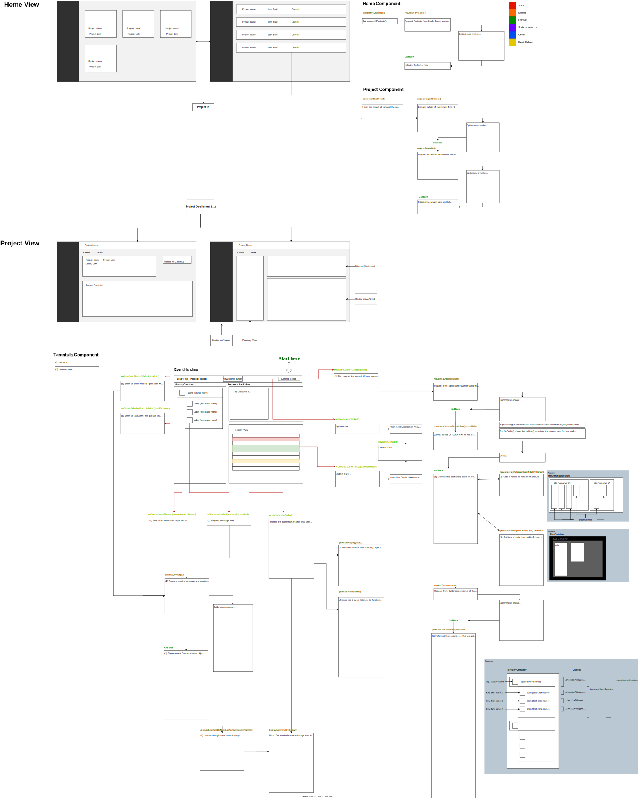

# SpiderSense View

The frontend of the SpiderSense project.

## Requirements

This project was bootstrapped with [Create React App](https://github.com/facebook/create-react-app).

1. [Node.js](https://nodejs.org/en/)
    - Includes the node package manager (npm) and the node package runner (npx)  
1. [SpiderSense-worker](https://github.com/spideruci/spidersense-worker)  
    - The backend of the project. Visit the link to check additional requirements, such as having MySQL installed.
1. Database file(s) for the SpiderSense-worker

## Dependencies

1. [react-router-dom](https://www.npmjs.com/package/react-router-dom)
1. [react-cookie](https://www.npmjs.com/package/react-cookie)
1. [@material-ui/icons](https://www.npmjs.com/package/@material-ui/icons)  
1. [@material-ui/core](https://www.npmjs.com/package/@material-ui/core)
1. [D3](https://www.npmjs.com/package/d3)

## Getting started

1. Install requirements
1. Install dependencies (See below for instructions)
1. Git clone this project (https://github.com/spideruci/spidersense-view.git)
1. Git clone the backend (https://github.com/spideruci/spidersense-worker.git)
    * Install programs and other dependencies for the backend
    * Configure the database uri and the config path
    * Import database file(s) 
    * Run the worker, which should be served on local port 5000
1. To build this project, execute on the command line `npm run build`
1. To run the project locally, execute on the command line `npm start`

## Installing the Dependencies
Note: Check the links to the corresponding packages for more up-to-date instructions

`npm i react-router-dom`  
`npm i react-cookie`  
`npm i @material-ui/icons`  
`npm i @material-ui/core`  
`npm i d3`  

## Tarantula

The Tarantula component is a large and complicated file. Many of the state variables and methods in that class are used to request data from the SpiderSense-worker backend, bind that data to elements on the interface, and  dynamically generate those elements using D3. Most of the files and methods are documented, but to make understanding this part of the frontend easier, a diagram of the architecture of this component is included.  

The diagram can be found under the **/docs** directory and contains both JPEG and SVG formats.  

## Tarantula diagram:

## Computing Suspiciousness scores to assist in Fault Localization  

Under **/src/models**, there are two files written for the computation. Both complete the same task, but one uses JS objects and the other JS's Map object. I am unsure which works more efficiently, and if anything, this entire module can be re-written to be better optimized.  

## Future tasks
For future developer(s) of this project, there are a few things that could be done to optimize the frontend.
1. A system to recycle the file containers in the horizontal scroll view of the Tarantula component.  
    - A potential issue is that as more files are downloaded from Github, more DOM nodes (SVG, text, tspan) elements will be created. This may slow the browser and the user's experience.
1. A system that allows users to have their own accounts, and for each account, they can follow multiple Github projects.  
1. CSS/SCSS updates to make the browser more responsive for mobile and desktop users.  
1. Additional features that help users localize faults.  

## Other notes
- Check **vars.js** under **/src/vars** to view a list of objects, exported to components that need it. These objects contain static, textual data that is populated on the user interface. So changing the values of these objects will update the text displayed in the corresponding components.

## Available Scripts

In the project directory, you can run:

### `npm start`

Runs the app in the development mode. 
Open [http://localhost:3000](http://localhost:3000) to view it in the browser.

The page will reload if you make edits. 
You will also see any lint errors in the console.

### `npm run build`

Builds the app for production to the `build` folder. 
It correctly bundles React in production mode and optimizes the build for the best performance.

The build is minified and the filenames include the hashes. 
Your app is ready to be deployed!

*Note*: If `npm run build` fails to minify, visit https://facebook.github.io/create-react-app/docs/troubleshooting#npm-run-build-fails-to-minify

### Learn More

You can learn more in the [Create React App documentation](https://facebook.github.io/create-react-app/docs/getting-started).

To learn React, check out the [React documentation](https://reactjs.org/).
